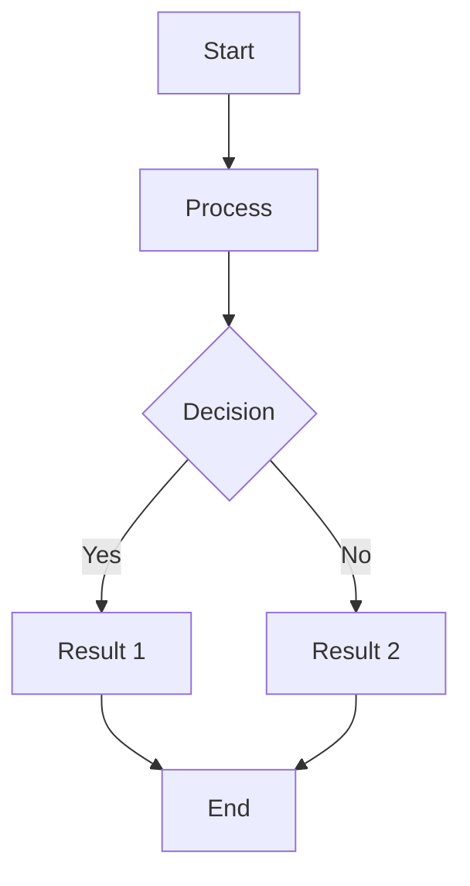
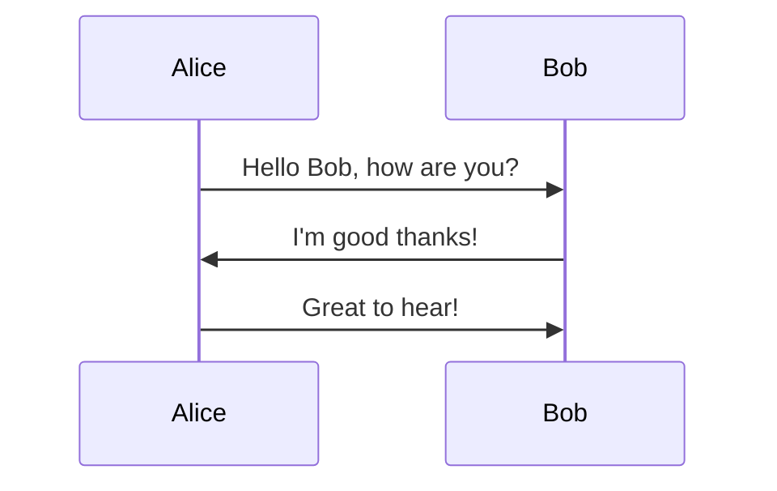

# Mermaid Diagram Editor for Frappe

A comprehensive Mermaid.js integration for Frappe Framework, providing a modern, feature-rich diagram editor with real-time collaboration, dark mode, and extensive export options.

## Features

### 🎨 Modern Editor Interface
- **Split-pane editor** with live preview
- **Dark mode support** with automatic theme switching
- **Fullscreen mode** for distraction-free editing
- **Responsive design** that works on all devices
- **Tailwind CSS** for modern, consistent styling

### 📊 Comprehensive Diagram Support
- **Flowcharts** - Process flows and decision trees
- **Sequence Diagrams** - System interactions and API flows
- **Class Diagrams** - Object-oriented design documentation
- **State Diagrams** - State machines and workflows
- **Entity Relationship Diagrams** - Database schema visualization
- **User Journey Maps** - User experience flows
- **Gantt Charts** - Project timelines and scheduling
- **Pie Charts** - Data visualization
- **Gitgraph** - Git branching strategies
- **C4 Context Diagrams** - System architecture
- **Mindmaps** - Brainstorming and concept mapping
- **Timeline** - Historical events and milestones
- **ZenUML** - Unified Modeling Language
- **Sankey Diagrams** - Flow visualization

### 🚀 Advanced Editor Features
- **Template Library** - Quick start with pre-built diagram templates
- **Syntax Highlighting** - Code editor with Mermaid syntax support
- **Auto-formatting** - Automatic code indentation and formatting
- **Keyboard Shortcuts** - Efficient editing with hotkeys
- **Tab Support** - Proper indentation with Tab/Shift+Tab
- **Error Handling** - Real-time syntax validation and error display
- **Auto-save** - Automatic saving with unsaved changes indicator

### 🔄 Real-time Collaboration
- **Live Updates** - See changes from other users in real-time
- **Connection Status** - Visual indicator of collaboration status
- **Conflict Resolution** - Automatic handling of concurrent edits
- **User Presence** - Know who's editing the diagram

### 📤 Export & Sharing
- **SVG Export** - Vector graphics for high-quality prints
- **PNG Export** - Raster images with custom resolution
- **Code Export** - Raw Mermaid code for external use
- **Copy to Clipboard** - Quick sharing of diagram code
- **Public Sharing** - Make diagrams publicly accessible
- **User Permissions** - Fine-grained access control

### 🎛️ Zoom & Navigation
- **Zoom Controls** - In/Out/Reset zoom functionality
- **Zoom Percentage** - Visual zoom level indicator
- **Center Diagram** - Quick diagram centering
- **Pan Support** - Navigate large diagrams easily

### 💾 Data Management
- **Version History** - Track changes over time
- **Diagram Search** - Find diagrams by title or content
- **Filtering** - Filter by type, author, or date
- **Pagination** - Handle large diagram collections
- **Statistics** - Usage analytics and insights

## Installation

1. **Install the app:**
   ```bash
   bench get-app mermaid https://github.com/your-repo/mermaid
   bench install-app mermaid
   ```

2. **Install dependencies:**
   ```bash
   cd apps/mermaid
   npm install
   ```

3. **Build assets:**
   ```bash
   npm run build
   ```

4. **Migrate database:**
   ```bash
   bench migrate
   ```

## Development

### Prerequisites
- Node.js 16+ and npm
- Frappe Framework v14+
- Modern browser with ES6+ support

### Setup Development Environment

1. **Clone and install:**
   ```bash
   bench get-app mermaid
   cd apps/mermaid
   npm install
   ```

2. **Start development server:**
   ```bash
   npm run dev
   ```

3. **Type checking:**
   ```bash
   npm run type-check
   ```

4. **Linting:**
   ```bash
   npm run lint
   ```

### Project Structure

```
mermaid/
├── mermaid/
│   ├── doctype/
│   │   └── mermaid_diagram/          # DocType definition
│   ├── public/
│   │   ├── js/
│   │   │   ├── components/           # Vue components
│   │   │   └── types/               # TypeScript definitions
│   │   └── css/                     # Stylesheets
│   ├── templates/                   # Jinja2 templates
│   └── www/                        # Web pages
├── package.json                    # Node.js dependencies
├── webpack.config.js              # Build configuration
├── tsconfig.json                  # TypeScript configuration
├── tailwind.config.js            # Tailwind CSS configuration
└── postcss.config.js             # PostCSS configuration
```

### Technology Stack

- **Frontend:** Vue 3, TypeScript, Tailwind CSS
- **Backend:** Python, Frappe Framework
- **Build:** Webpack, Babel, PostCSS
- **Diagram Engine:** Mermaid.js v10.6.1
- **Code Editor:** Monaco Editor integration ready
- **Export:** html-to-image, file-saver

## Usage

### Creating a New Diagram

1. Navigate to **Mermaid Diagram** in the desk
2. Click **New** to create a new diagram
3. Choose a template or start from scratch
4. Use the editor to write your Mermaid code
5. Preview updates in real-time
6. Save when ready

### Keyboard Shortcuts

| Shortcut | Action |
|----------|--------|
| `Ctrl+S` | Save diagram |
| `Ctrl+P` | Toggle preview |
| `Ctrl+Shift+F` | Format code |
| `F11` | Toggle fullscreen |
| `Tab` | Indent line |
| `Shift+Tab` | Unindent line |

### Template Examples

#### Flowchart


#### Sequence Diagram


## API Reference

### Python Methods

#### `create_new_diagram(title, diagram_type, content, description)`
Create a new Mermaid diagram.

#### `update_mermaid_content(name, content, rendered_svg)`
Update diagram content and rendered SVG.

#### `get_diagram_list(filters, limit, start)`
Get paginated list of diagrams.

#### `search_diagrams(query, limit)`
Search diagrams by title or content.

#### `export_diagram(name, format)`
Export diagram in various formats.

### JavaScript Events

#### `diagram-type-changed`
Emitted when diagram type is changed.

#### `content-updated`
Emitted when diagram content is updated.

## Configuration

### Mermaid Configuration
The editor uses the following Mermaid configuration:

```javascript
{
  startOnLoad: false,
  theme: 'default', // or 'dark' in dark mode
  securityLevel: 'loose',
  flowchart: {
    useMaxWidth: false,
    htmlLabels: true
  },
  sequence: {
    useMaxWidth: false
  }
}
```

### Customization
You can customize the editor by modifying:

- **Themes:** Update `tailwind.config.js` for styling
- **Templates:** Add new templates in `types/diagram.ts`
- **Shortcuts:** Modify keyboard shortcuts in the Vue component
- **Export Options:** Add new export formats in the backend

## Troubleshooting

### Common Issues

1. **Diagrams not rendering:**
   - Check browser console for JavaScript errors
   - Ensure Mermaid.js is loaded properly
   - Verify diagram syntax is correct

2. **Build errors:**
   - Run `npm install` to ensure dependencies are installed
   - Check Node.js version (requires 16+)
   - Clear `node_modules` and reinstall if needed

3. **Permission errors:**
   - Check user permissions for Mermaid Diagram DocType
   - Verify role assignments in User settings

### Performance Tips

- Use pagination for large diagram collections
- Enable browser caching for static assets
- Consider server-side rendering for public diagrams
- Optimize images before embedding in diagrams

## Contributing

1. Fork the repository
2. Create a feature branch
3. Make your changes
4. Add tests if applicable
5. Submit a pull request

### Code Style

- Use TypeScript for type safety
- Follow Vue 3 Composition API patterns
- Use Tailwind CSS for styling
- Write descriptive commit messages
- Add JSDoc comments for functions

## License

MIT License - see LICENSE file for details.

## Support

- **Documentation:** [Wiki](https://github.com/your-repo/mermaid/wiki)
- **Issues:** [GitHub Issues](https://github.com/your-repo/mermaid/issues)
- **Discussions:** [GitHub Discussions](https://github.com/your-repo/mermaid/discussions)
- **Community:** [Frappe Forum](https://discuss.frappe.io)

## Changelog

### v1.0.0
- Initial release with full Mermaid.js integration
- Vue 3 + TypeScript editor
- Real-time collaboration
- Dark mode support
- Comprehensive export options
- Template library
- Mobile responsive design
